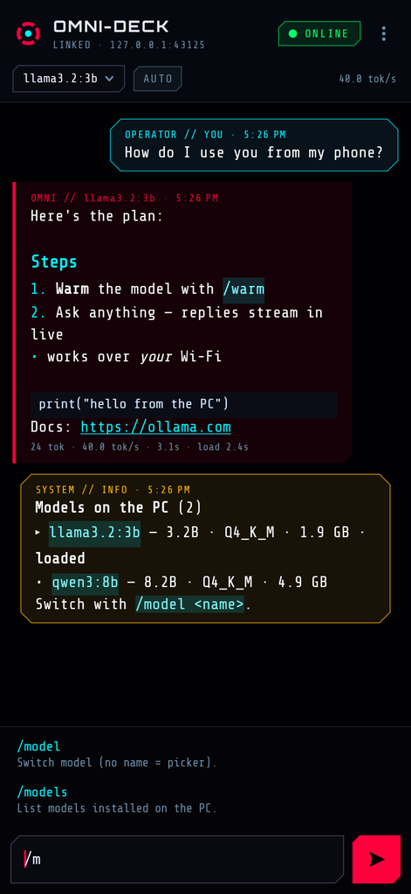
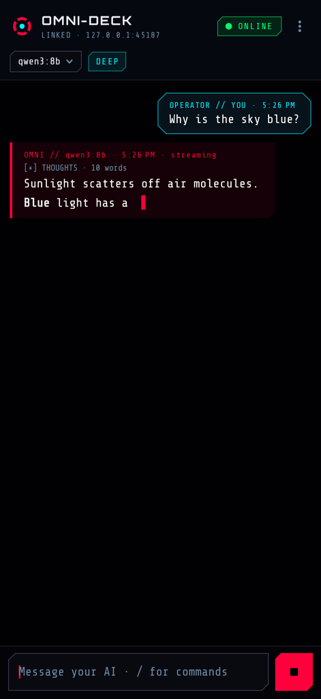
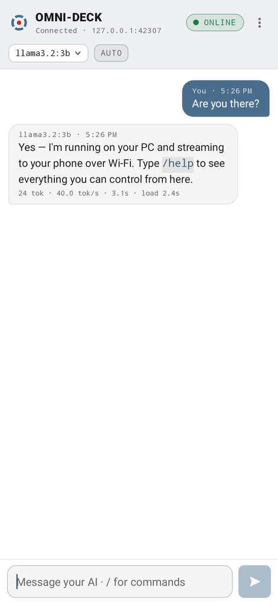
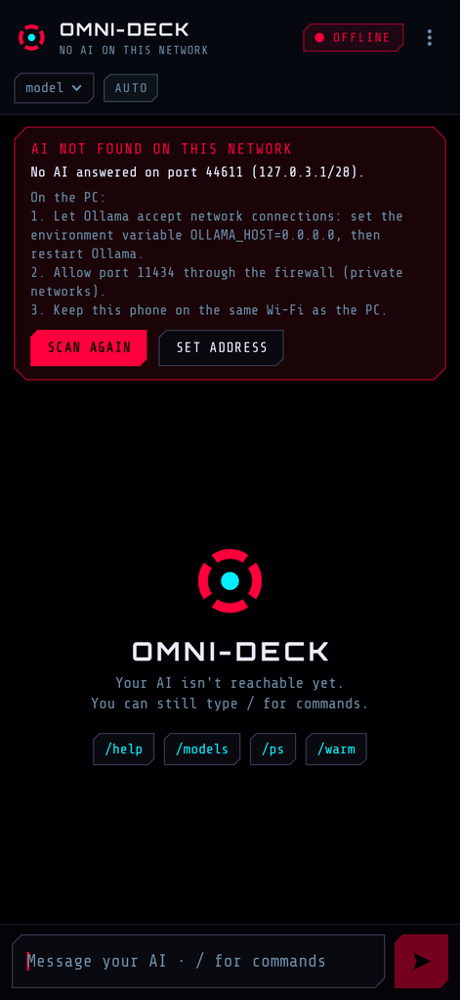

# OmniDeck Mobile

An Android companion for OMNI-DECK. It finds the AI running on your PC (Ollama) on your Wi-Fi, streams its replies to your phone word by word, and lets you chat with it and control it with the same slash commands you use in `OllamaChat.html`.

| Cyber (dark) | Streaming | Light | Not found |
|---|---|---|---|
|  |  |  |  |

**Download:** [`dist/OmniDeck-Mobile.apk`](dist/OmniDeck-Mobile.apk). It needs Android 6.0 or newer and is about 300 KB.

## Install

1. Open the APK on your phone. If Android asks, allow your browser or file manager to *install unknown apps*.
2. Play Protect may say it doesn't recognize the app. Choose **More details → Install anyway**, because the app isn't on the Play Store.
3. Open **OmniDeck** while the phone is on the same Wi-Fi as your PC.

## One-time PC setup

By default Ollama only answers the PC itself. To let the phone reach it:

1. **Allow network connections.** Set the environment variable `OLLAMA_HOST=0.0.0.0`, then quit and restart Ollama.
   - Windows: run `setx OLLAMA_HOST 0.0.0.0`, then right-click the Ollama tray icon → Quit, and start Ollama again.
   - macOS: run `launchctl setenv OLLAMA_HOST "0.0.0.0"`, then restart the Ollama app.
   - Linux (systemd): run `systemctl edit ollama`, add `Environment="OLLAMA_HOST=0.0.0.0"` under `[Service]`, then `systemctl restart ollama`.
2. **Open the firewall** for TCP port 11434 on private networks. On Windows, from an admin prompt:
   `netsh advfirewall firewall add rule name="Ollama LAN" dir=in action=allow protocol=TCP localport=11434 profile=private`

That's it: the app finds the PC by itself. If your network blocks discovery, tap the status pill → **Set address** and enter the PC's IP (e.g. `192.168.1.20`).

> Ollama's API has no password. Once it listens on the network, anyone on the same Wi-Fi can use it, so only do this on networks you trust.

## What it does

- **Finds your AI automatically.** It tries the last PC that worked, then sweeps your Wi-Fi subnet in parallel (about 1–2 s). It re-checks every 10 s and reconnects on its own when the PC or Wi-Fi comes back. LAN traffic stays on Wi-Fi even when Android prefers mobile data (Wi-Fi without internet).
- **Streams replies live.** Tokens appear as the PC generates them, with Markdown (code blocks, lists, links) and a **stop** button. Each reply shows its speed (tok/s).
- **Shows "thinking" models' reasoning** in a collapsible block (Ollama's `thinking` field or `<think>` tags).
- **Doesn't slow the PC down.** Requests use the same runner settings as OMNI-DECK (`num_ctx` matched to the loaded model, else 8192; `keep_alive` explicit), so switching between PC and phone doesn't force Ollama to reload the model.
- **Matches OMNI-DECK's look.** The cyber theme uses its neon palette, chamfered corners and Orbitron / Share Tech Mono fonts. The light theme mirrors its "modern" theme. By default the app follows your phone's dark mode.
- **Saves chats on the phone** (`/history`), unless `/incognito on`.
- **Accepts shared text.** Share text from any app to OmniDeck to ask about it.

## Commands

Type `/` to see suggestions. Start a message with `//` to send text that begins with a slash.

| Chat | |
|---|---|
| `/help` | every command |
| `/reset` (`/new`, `/clear`) | new conversation |
| `/stop`, `/regen` | stop the reply, regenerate the last one |
| `/system <prompt \| clear>` | system prompt / persona |
| `/summarize`, `/compact` | summarize; shrink history into a summary to free context |
| `/history [name]`, `/export` | open saved chats, share the chat as text |
| `/remember`, `/facts`, `/forget` | facts sent with every message |
| `/incognito on\|off` | don't save chats |

| Control the AI | |
|---|---|
| `/model [name]`, `/models`, `/ps` | switch / list installed / list loaded models |
| `/warm`, `/unload [name]` | load a model into memory / free it |
| `/pull <name \| stop>` | download a model onto the PC, with progress |
| `/deep [model]`, `/fast`, `/auto` | thinking on (optionally a separate deep model), off, or automatic |
| `/bench` | measure load, prompt and generation speed |

| App | |
|---|---|
| `/server [ip[:port] \| auto]`, `/scan` | set or show the address, list every AI server on the network |
| `/appearance cyber\|light\|auto`, `/settings`, `/debug` | theme, settings, connection diagnostics |
| `/timer 5m tea`, `/clip` | in-app timer, paste the phone's clipboard |

**PC control** (`/open <app>`, `/vol [0-100]`, `/sys`, `/shot`, `/pcclip`, `/pair`, `/desk`) talks to OMNI-DECK's LaunchBridge on port 8765 using the same API the web app uses. LaunchBridge listens only on `127.0.0.1` today, so these work once it's reachable from the network. Then run `/pair` once. `/web`, `/investigate`, `/task` and the other PC-app-only commands reply that they run in OMNI-DECK on the PC.

## Settings worth knowing

- **Context size / CPU threads.** Ollama reloads a model whenever `num_ctx` or `num_thread` differ between requests. *Auto* matches what's loaded. If OMNI-DECK on the PC sets a thread count (half your logical cores), enter the same number here. The app shows a hint the first time it detects a reload.
- **Keep model loaded** sends `keep_alive: -1`, like OMNI-DECK's default.

## Build from source

Everything builds on a plain Linux box. You don't need Android Studio or Gradle for the APK itself:

```bash
./build.sh   # installs aapt/dx/zipalign/apksigner from apt if missing → dist/OmniDeck-Mobile.apk
./test.sh    # 43 JVM tests: Ollama client, streaming, cancel, LAN scan, bridge, commands, markdown, storage
cd uitest && gradle test   # 21 Robolectric runs: the real UI on Android 6.0 and 14 + screenshots in build/screens
```

The signing key is created in `.keystore/` on the first build and is git-ignored. Keep it if you want future builds to install over the current app; a different key means uninstalling first.

Layout:

- `src/…/core/`: pure Java with no Android dependencies, unit-tested on the JVM.
  - `OllamaClient` (NDJSON streaming, models, pull), `LanScanner` (discovery), `BridgeClient` (LaunchBridge).
  - `Commands`, `Markdown`, `Conversation` + `ConversationStore`.
- `src/…/Engine.java`: connection state, health checks, streaming, and commands. It lives for the whole process, so replies survive rotation and theme changes.
- `src/…/MainActivity.java` and `ui/`: the screen, themes, and drawables. The UI is built in code with no AndroidX dependency.
- `test/`: JVM tests plus `MockOllama` / `MockBridge`, which mirror the real APIs.
- `uitest/`: the Robolectric suite. `src/stubs` holds a minimal `androidx.test` stand-in, because Google's Maven wasn't reachable from the build machine.

## Credits

The bundled fonts are converted from Orbitron (The Orbitron Project Authors) and Share Tech Mono (Carrois Type Design), both under the SIL Open Font License 1.1. See [`assets/fonts/OFL.txt`](assets/fonts/OFL.txt).
